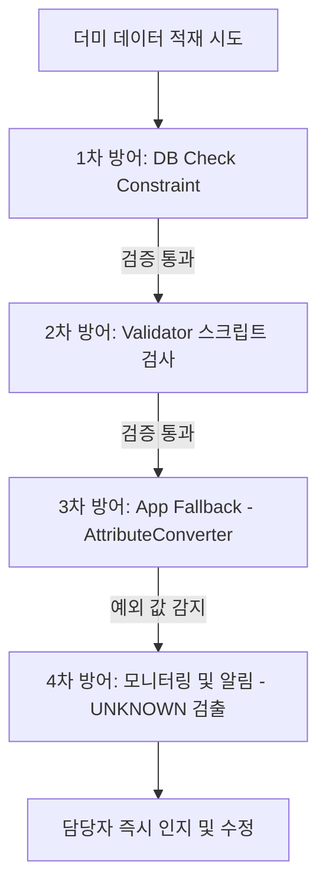

# 더미 데이터 추가 시 Enum 불일치 오류 방지 종합 계획서

## 1. 목적
본 계획서는 더미 데이터 생성 및 적재 과정에서 발생할 수 있는 Enum 값 불일치 문제를 사전에 예방하고, 잘못된 데이터가 유입되더라도 서비스 장애로 이어지지 않도록 다중 방어 체계를 구축하는 것을 목적으로 한다.

---

## 2. 문제 배경

### 발생 사례
DB에 저장된 상태값 문자열과 백엔드 Enum 정의가 일치하지 않을 경우 엔티티 조회 시 변환 오류가 발생한다.

**예시**
```sql
-- 데이터베이스 적재 데이터
status = 'REQUESTED'
```

```java
// 백엔드 Enum 정의
public enum PurchaseStatus {
    DRAFT,
    APPROVED
}
```

**조회 시**
```java
PurchaseStatus.valueOf("REQUESTED")
```
위 변환 실행 과정에서 예외가 발생하여 서버 내부 에러를 유발한다.
```text
java.lang.IllegalArgumentException: No enum constant com.dduk.entity.inventory.PurchaseStatus.REQUESTED
```

### 영향 범위
* **API 500 오류 발생**: 백엔드 REST API의 응답 실패 유발.
* **프론트엔드 데이터 조회 실패**: 전체 페이지 데이터 렌더링 중단.
* **AI/RPA 위젯 로딩 실패**: 이상 탐지 및 예측 분석 위젯 등 비동기 컴포넌트 동작 불가능.
* **운영 환경 장애 발생 가능**: 실제 운영 중 정합성이 깨진 데이터 인입 시 전체 장애 전파.
* **장애 원인 추적 비용 증가**: 명확한 로깅이 없으면 원인 파악에 긴 디버깅 시간 소요.

---

## 3. 원인 분석

### 기술적 원인
* **Enum 정의 미확인**: 더미 데이터를 수동 혹은 외부 툴로 작성할 때 백엔드 Enum 명세를 확인하지 않음.
* **SQL 직접 입력 과정의 오타**: 수작업 쿼리 실행 과정에서 문자열 오타 발생.
* **Enum 리팩토링 후 데이터 미정비**: 백엔드 코드의 Enum 상수를 변경/삭제했으나 기존 데이터베이스의 데이터는 마이그레이션하지 않고 방치함.
* **환경별 데이터 정합성 불일치**: 로컬, 스테이징, 운영 환경의 데이터베이스 인스턴스 간 데이터 동기화 누락.

### 운영적 원인
* **데이터 검증 절차 부재**: SQL 스크립트 실행 전 스키마 정합성을 체크하는 검증 루틴 누락.
* **Enum 변경 시 영향도 점검 미흡**: 코드 변경 시 DB 영향도 분석 및 테스트 미실행.
* **배포 전 테스트 자동화 부족**: 더미 데이터의 정상 로딩 여부를 확인하는 자동화 테스트 누락.

---

## 4. 다중 방어 전략 (Defense-in-Depth)
본 문제는 단일 대책으로 해결하지 않고, 다음 4단계 방어 체계를 적용하여 데이터 인입부터 사후 인지까지 촘촘히 통제한다.



### [1차 방어] 데이터베이스 제약조건 (DB Constraints)
* **목적**: 잘못된 데이터 삽입 자체를 스키마 레벨에서 거부한다.
* **구현 방안**: 
  - 테이블의 `status` 컬럼에 `CHECK` 제약 조건을 부여하여 정의되지 않은 문자열의 `INSERT`/`UPDATE`를 원천 차단한다.
* **예시**:
  ```sql
  ALTER TABLE purchase_orders 
  ADD CONSTRAINT chk_purchase_status 
  CHECK (status IN ('DRAFT', 'APPROVED', 'SENT_TO_VENDOR', 'ORDERED', 'COMPLETED', 'CANCELLED'));
  ```
* **기대효과**: 잘못된 더미 데이터가 저장되는 것을 물리적으로 방지하며, 데이터 품질을 보장한다.

### [2차 방어] 더미 데이터 사전 검증기 (Validator)
* **목적**: 데이터 적재 시도 전, 로컬 혹은 CI 파이프라인에서 Enum 정합성을 사전 검사한다.
* **구현 방안**:
  - SQL/CSV 파일 내 삽입 대상 컬럼의 값들을 추출하여 백엔드 Java Enum 목록과 매핑을 확인하는 사전 검증 스크립트(Python 등)를 구동한다.
* **검증 항목**:
  - Enum 값 존재 여부 및 오타 검출
  - 대소문자 불일치 체크
  - Null 허용 여부 및 제약조건 정합성 검사
* **기대효과**: 배포 혹은 적재 작업 이전에 휴먼 에러를 조기 감지한다.

### [3차 방어] 애플리케이션 Fallback 처리 (JPA Converter)
* **목적**: 예상치 못한 미정의 데이터가 데이터베이스에 존재하더라도, 서비스가 폭사하여 중단되는 현상을 방지한다.
* **구현 방안**:
  - Enum에 `UNKNOWN` 상수를 선언하고, JPA `AttributeConverter`를 정의하여 올바르지 않은 값 변환 시 `UNKNOWN`으로 매핑한 후 `Warning` 로그를 남기도록 한다.
* **예시**:
  ```java
  public enum PurchaseStatus {
      DRAFT, APPROVED, SENT_TO_VENDOR, ORDERED, COMPLETED, CANCELLED,
      UNKNOWN // Fallback 용도
  }
  ```
  ```java
  @Converter(autoApply = true)
  public class PurchaseStatusConverter implements AttributeConverter<PurchaseStatus, String> {
      private static final Logger log = LoggerFactory.getLogger(PurchaseStatusConverter.class);

      @Override
      public String convertToDatabaseColumn(PurchaseStatus attribute) {
          return attribute != null ? attribute.name() : null;
      }

      @Override
      public PurchaseStatus convertToEntityAttribute(String dbData) {
          if (dbData == null) {
              return null;
          }
          try {
              return PurchaseStatus.valueOf(dbData.trim().toUpperCase());
          } catch (IllegalArgumentException e) {
              log.warn("[ENUM_FALLBACK] Unknown PurchaseStatus value detected in DB: {}. Fallback to UNKNOWN.", dbData);
              return PurchaseStatus.UNKNOWN;
          }
      }
  }
  ```
* **기대효과**: 런타임 오류가 발생하지 않아 화면의 다른 정상 기능이 정상 동작하며, 비정상 데이터의 유입 상태를 식별할 수 있다.

> [!CAUTION]
> **UNKNOWN Fallback 적용 시 필수 행동 지침**
> * 단순히 `UNKNOWN`으로 치환해 두고 방치하면 데이터 불일치 상태가 영구히 은폐될 수 있습니다.
> * `UNKNOWN` 감지 시 반드시 **Warning 로그 기록**, **모니터링 시스템 로그 집계**, **운영자 경고 알림**을 수행하도록 모니터링 연동을 설계해야 합니다.

### [4차 방어] 모니터링 및 알림 (Monitoring)
* **목적**: 3차 방어에서 걸러진 `UNKNOWN` 상태의 발생 사실을 즉시 시스템 관리자가 파악하고 조치할 수 있게 한다.
* **구현 방안**:
  - 로그 파일 내 `[ENUM_FALLBACK]` 등의 특정 접두사 태그가 찍힐 시, 로그 분석기(Elasticsearch, Promtail 등)가 이벤트를 포착하여 실시간 알림을 발송한다.
* **알림 예시 (Slack/Teams 연동)**:
  ```text
  [ALERT] 이상 데이터 감지 - Enum 역직렬화 Fallback 발생
  - 일시: 2026-06-02 12:30:15
  - 컬럼: PurchaseStatus
  - 감지된 값: REQUESTD (오타 의심)
  - 발생 환경: Staging DB
  ```

---

## 5. 아키텍처 고도화를 위한 심화 전략

### A. 비즈니스 로직 상 UNKNOWN 핸들링 보완
* `UNKNOWN`으로 폴백된 데이터가 비즈니스 로직(정산, 승인 등)으로 흐를 경우, 의도치 않은 비즈니스적 오동작이 발생할 수 있습니다.
* 이에 대비하여, 비즈니스 처리 단에서는 `UNKNOWN` 상태인 데이터를 **수정/처리 보류 상태**로 차단하고 읽기 전용(Read-Only) 경고 필드로 표시하는 비즈니스 예외 분기 처리를 포함해야 합니다.

### B. API JSON 역직렬화(Jackson) Fallback 적용
* 데이터베이스 조회뿐만 아니라 프론트엔드로부터 유입되는 JSON 데이터(Request Body) 파싱 오류도 방지해야 합니다.
* Jackson `ObjectMapper` 설정에 `DeserializationFeature.READ_UNKNOWN_ENUM_VALUES_AS_NULL`을 켜거나, 각 Enum 클래스에 `@JsonCreator`와 `@JsonValue`를 활용해 파싱 실패 시 `UNKNOWN`으로 안전하게 치환되도록 설정합니다.

---

## 6. 테스트 전략

### 단위 테스트
```text
[입력값] REQUESTED      --> [결과] REQUESTED (정상 상태)
[입력값] INVALID_STATUS --> [결과] UNKNOWN (폴백 검증)
[입력값] NULL           --> [결과] NULL (정상 null 허용 확인)
```

### 통합 테스트
* 더미 데이터를 인위적으로 적재한 후, 데이터 조회 API를 전체 호출하여 HTTP 500이 터지지 않고 정상 응답(HTTP 200)이 오는지 테스트 자동화 검증.

### 회귀 테스트
* Enum 상수를 추가/수정하는 리팩토링 진행 시, DB에 있는 기존 보존 데이터의 상태값 정합성과 배치 프로그램의 정상 실행 여부를 빌드 파이프라인 상에서 검증.

---

## 7. 실행 로드맵

| 단계 | 작업 내용 | 우선순위 |
| :--- | :--- | :--- |
| **1단계** | 주요 엔티티의 Enum 클래스 하위에 `UNKNOWN` 상수 선언 | **High** |
| **2단계** | JPA `AttributeConverter` 구현 및 `@Converter(autoApply = true)` 적용 | **High** |
| **3단계** | 로컬 적재용 SQL/CSV 검증용 Python 스크립트 작성 및 릴리즈 절차 포함 | **High** |
| **4단계** | 데이터베이스 스키마 테이블 정의서 분석 후 `CHECK` 제약조건 DDL 적용 | **High** |
| **5단계** | Jackson Deserializer Fallback 공통 빈(Bean) 설정 추가 | **Medium** |
| **6단계** | 로깅 경고 태그 기반 Slack/Teams 알림 봇 연동 및 모니터링 시스템 구축 | **Medium** |
| **7단계** | Enum 변경 시 DDL 마이그레이션 처리 절차 가이드라인 문서화 | **Low** |

---

## 8. 기대 효과
* **장애 예방**: Enum 불일치로 인한 갑작스러운 API 500 에러 및 화면 마비 장애 100% 차단.
* **품질 향상**: 적재 전 사전 검증을 통해 더미 데이터의 설계 품질 및 데이터 정합성 유지.
* **유지보수 비용 감소**: 비정상 값이 인입되었을 때 로그 분석으로 장애 유발의 직접적 원인과 대상을 초 단위로 신속 인지.
